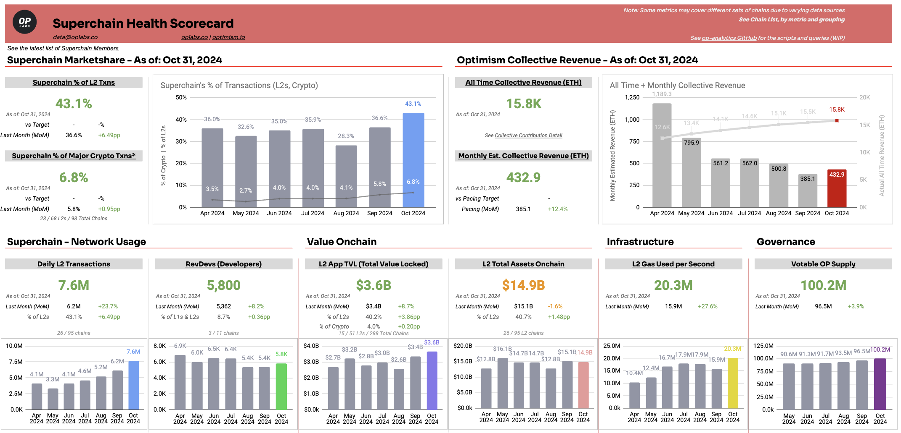
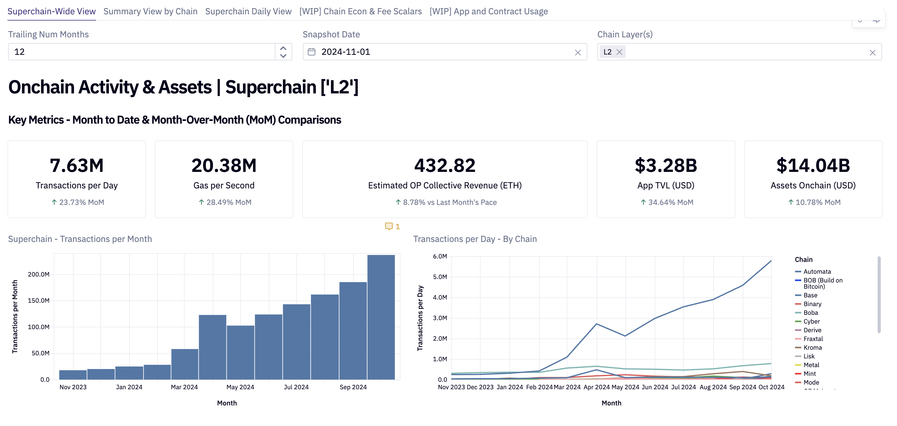
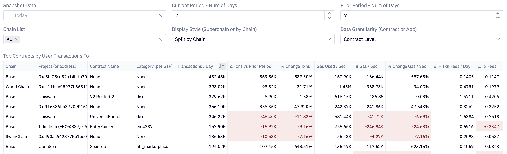
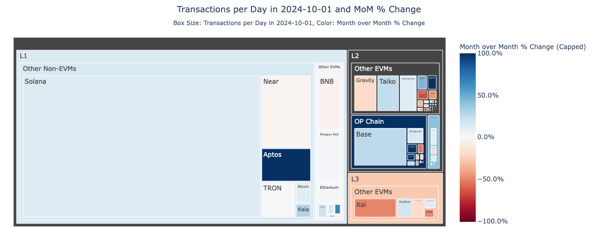

# Building Ecosystem Health Metrics with Open Data Sources - Devcon 2024

## Session Links!
- [Sample Data Google Sheet (Copy this to build your charts!)](https://docs.google.com/spreadsheets/d/1qHQ4pLWiZ_xT8ofJcYZZoNxh7_B1TW_XqeBm6xwE8Z8/edit?gid=0#gid=0)
- [Optimism Superchain Health Dashboard](https://docs.google.com/spreadsheets/d/1f-uIW_PzlGQ_XFAmsf9FYiUf0N9l_nePwDVrw0D5MXY/edit?gid=584971628#gid=584971628)

---

### [📊 See the Superchain Ecosystem Health Dashboard ✨](https://docs.google.com/spreadsheets/d/1f-uIW_PzlGQ_XFAmsf9FYiUf0N9l_nePwDVrw0D5MXY/edit?gid=584971628#gid=584971628)

### 🔑 Key Resources
- [Defillama API Docs](https://defillama.com/docs/api)
  - [Defillama Repo](https://github.com/DefiLlama)
- [Growthepie API Docs](https://docs.growthepie.xyz/api)
- [L2Beat Repo](https://github.com/l2beat/l2beat)

### 🎼 OP Analytics Content - Scripts
- In Use Data Pulls: [OP Chains](https://github.com/ethereum-optimism/op-analytics/tree/main/op_chains_tracking) | [Other Chains](https://github.com/ethereum-optimism/op-analytics/tree/main/other_chains_tracking)
- [In Use Helper Functions](https://github.com/ethereum-optimism/op-analytics/tree/main/helper_functions)
- [WIP Future State Data Pulls & Models](https://github.com/ethereum-optimism/op-analytics/tree/main/src/op_analytics)
  - [Documentation](https://static.optimism.io/op-analytics/sphinx/html/index.html)
- [GitHub Actions Runs](https://github.com/ethereum-optimism/op-analytics/actions)

### 🏄 OP Analytics Content - Additional Dashboards
- [Supercharts - Charts overall and by chain](https://app.hex.tech/61bffa12-d60b-484c-80b9-14265e268538/app/a7697196-fdfd-4a59-88ef-d91d52801518/latest)
- [App/Contract Usage](https://app.hex.tech/61bffa12-d60b-484c-80b9-14265e268538/app/cd3f1525-08f0-4a49-a15a-b72f46f2a0d8/latest)
- [Chain Growth](https://app.hex.tech/61bffa12-d60b-484c-80b9-14265e268538/app/237e99a4-5cf5-4535-aa25-eb752c4e6028/latest)

