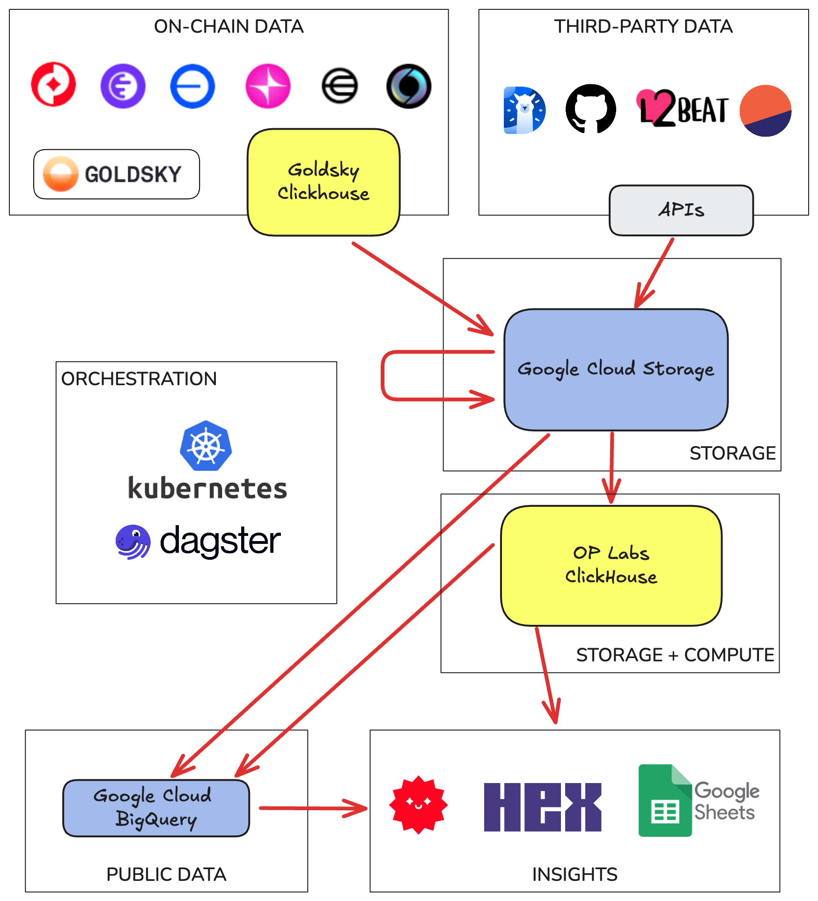
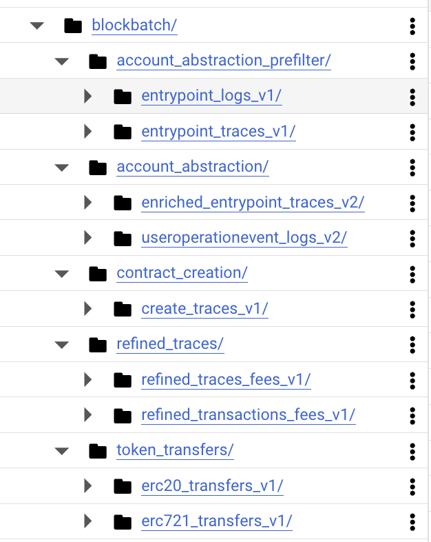

# Architecture

The diagram below shows the high level architecture of the OP Labs Data Platform.


<div style="text-align: center;">
    
</div>

## Ingestion

We ingest raw-onchain data from Goldsky, using a Goldsky-owned ClickHouse instance as the data
interface. 

We also ingest data from numerous third-party sources. Primarily from API endpoints, but also by
other means (public gcs buckets, reading onchain contracts, etc). 
 

## Storage

Our primary storage layer is Google Cloud Storage (GCS).

We use a single GCS bucket for all data, with the following naming convention:
```
gs://BUCKET/ROOT_PATH/partitionA=0/partitionB=1/file.parquet
```

The `ROOT_PATH` of a dataset is almost like a table name. It can be nested, so we can group related
datasets together in a hierarchy. 

The most common partition used is `dt` (for date). We use it in almost all our datasets as we
generally stick to daily data processing. For multichain datasets we also use the `chain` partition.

The file format used is always Parquet.

Below we show some example root paths in GCS. These paths are for a family of tables called 
`blockbatch`. As you can see we have multiple levels of
neseting:

<div style="text-align: left;">
    
</div>


## ClickHouse Data Warehouse 

We use ClickHouse as our data warehouse. We use the S3 Table Engine to read data directly from GCS.
We have a number of convenience functions that let us read by specifying the root path of the data 
in GCS and a partition value. For some data sources we also ingest data directly into ClickHouse 
(without writing to GCS first).


## BigQuery Data Warehouse 

Legacy data ingestion processe at OP Labs write data directly to BigQuery. Using BigQuery is not as
cost-effective as using ClickHouse, so we are moving away from it.  For new data sources always
use either GCS or ClickHouse..


## Processing and Orchestration

We use dagster running on kubernetes to orchestrate ingestion and processing of data. This includes:

* Ingestion, which reads from input data sources and writes to GCS/ClickHouse. 

* Processing, which reads from GCS/ClickHouse, processes in Kubernetes (using DuckDB or polars) 
  and writes back to GCS/ClickHouse. 

* Transforms, which run as ClickHouse queries. These can read and write from GCS also (using
  the clickhouse s3 table engine) but usually are from/to ClickHouse native tables.

* Exports, which read from GCS or ClickHouse and write to BigQuery. We use this for public tables
  and also to expose data to insight tools that must use BigQuery to read data.


## Insights

We use a number of tools to help us create dashboards and reports. Our main tool is Hex but we also
use Streamlit and Google Sheets.

