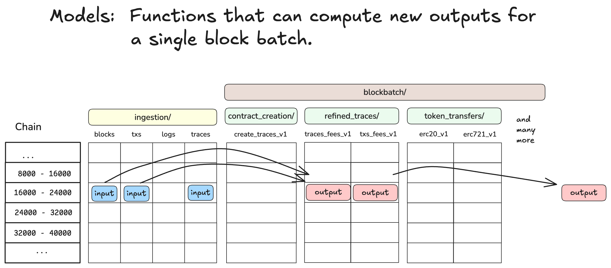

# Blockbatch Models

Blockbatch models are a way to process onchain data from the data lake and store results back in
the data lake. 

<div style="text-align: center;">
    
</div>


The image above shows our mental model of `blockbatch` processing (for a single chain), where each
cell represents a batch. For each batch we have the core ingestion root paths and we have many other
root paths that are computed starting from the raw data. These derived datasets we refer to as the
"blockbatch models".

Processing raw data is expensive, so we compute as many blockbatch models as we can to make further
analysis cheaper. 

At OP Labs we have simple filtering models, such as:

- `blockbatch/contract_creation/create_traces_v1`
- `blockbatch/token_transfers/erc20_transfers_v1`
- `blockbatch/token_transfers/erc721_transfers_v1`

We also have models that compute fee breakdowns:
- `blockbatch/refined_traces/refined_transactions_fees_v2`
- `blockbatch/refined_traces/refined_traces_fees_v2`

And we have models where we do more complex contract analysis (including decoding):
- `blockbatch/account_abstraction/enriched_entrypoint_traces_v2`
- `blockbatch/account_abstraction/useroperationevent_logs_v2`
- `blockbatch/account_abstraction_prefilter/entrypoint_logs_v1` 
- `blockbatch/account_abstraction_prefilter/entrypoint_traces_v1`

## Inexpensive Joins

Blockchain data processing usually involves joining data from the different raw datasets. For example
you may want to join logs with traces or transactions with traces.

Outside of `blockbatch` data processing this is difficult because compute engines have to perform
a distributed join across many blocks to produce the joined result. It seems possible, but is 
difficult to get the compute engine to perform a storage layout based optimization of these joins.
(see for example [Storage Partitioned Joins in Apache Spark](https://books.japila.pl/spark-sql-internals/storage-partitioned-joins/)).

Within `blockbatch` processing we can load data for a specific batch into memory without having to
scan the storage layer (O(1) access to batches due to the deterministic path). And so we can
leverage this to much more effectively perform computations that require joins across root_paths.
Regardless of whether the root_path is one of the 4 core datasets or one derived from a model.

## DuckDB Compute Engine

Having tackled the problem of getting the right data into memory in the local context we now have
to make a choice: how do we perform computations on this data?  Enter DuckDB.

We chose DuckDB as the compute engine for `blockbatch` for the following reasons:

- **Performance**. DuckDB is very fast for SQL queries.
- **Extensibility**. DuckDB can be enhanced with native UDFs and Python based UDFs. The Python UDFs are
  critical for our ability to decode smart contract data. 
- **Streaming capabilities**. DuckDB can stream data from the storage layer to the compute engine and
  most importantly it can also stream write data back to the storage layer. This minimizes the 
  memory footprint required to perform computations. 
- **Documentation**. DuckDB has excellent documentation and a very active community.

## Interface

We wanted a single interface to perform all `blockbatch` processing. The goal is to be able to 
specify three pieces of information and have the system figure out the rest. The three pieces of 
information are:

- The date range we want to process.
- The chains we want to process.
- The models we want to compute.

Behind the scenes the system will figure out which batches need to be processed, using markers to
determine which batches have already been processed. Depending on the required input data it will
decide if the batches are ready to be processed (avoids processing incomplete or missing input).

The interface is implemented as a single python function which can be called like this:

```python
compute_blockbatch(
    chains=normalize_chains("ALL,-kroma,-unichain_sepolia"),
    models=["refined_traces"],
    range_spec="@20240301:20240310",
    read_from=DataLocation.GCS,
    write_to=DataLocation.GCS,
    dryrun=False,
    force_complete=False,
    fork_process=True,
)
```

The `read_from` and `write_to` parameters specify where the data is stored and where the results
will be stored. We support both GCS and the local file system, but in practice we just use GCS most
of the time. The local file system is useful for development and testing.


## Model Definitions in Python

In the interface above models are referenced by their name as a string. The actual definition of
a model is a python function, which is decorated with the `@register_model` decorator to specify
the input datasets, auxiliary templates, and outputs that it produces. 

An example model definition is shown below:

```python
@register_model(
    input_datasets=[
        "ingestion/blocks_v1",
        "ingestion/traces_v1",
        "ingestion/transactions_v1",
    ],
    auxiliary_templates=[
        "refined_transactions_fees",
        "refined_traces/traces_projection",
        "refined_traces/traces_with_gas_used",
        "refined_traces/traces_txs_join",
    ],
    expected_outputs=[
        "refined_transactions_fees_v2",
        "refined_traces_fees_v2",
    ],
)
def refined_traces(
    ctx: DuckDBContext,
    input_datasets: dict[str, ParquetData],
    auxiliary_templates: dict[str, AuxiliaryTemplate],
) -> NamedRelations:
   ... LOGIC GOES HERE ...
```


The `input_datasets` and `expected_outputs` parameters in the decorator specify the data that is
needed and the data that will be produced.  The `auxiliary_templates` parameter specifies the location
of `.sql` files that contain SQL logic that can be leveraged to compute the model. How the templates
are used is up to the model definition.

When a model is executed the `blockbatch` processing system will find out where the input data is
in GCS and will inject it to the model function via the `input_datasets` function argument. It will
also inject the loaded SQL templates via the `auxiliary_templates` function argument.

The model function must return a `NamedRelations` object, which is a mapping of output name to
a DuckDB relation or view object that contains the results. 

The system will materialize the output DuckDB objects as parquet files in the storage layer.


## Prototyping

The tricky part when prototyping a model is the scaffolding that is needed to setup and call
the model definition python function. We have created a helper function that can be used from
an IPython notebook to do that. For reference we recommend looking at any notebook in the
`notebooks/adhoc/blockbatch_modesls` path in the repository.

## Integration Testing

Integration tests are crucial to ensure that the model logic is correct.  Our integration test
framework has a super useful feature which allows you to fetch real production data and use it in
test. When setting up an integration test you specify the range_spec (as blocks or dates) that
you want to test over and the first time you run the test it will fetch the real data and store it
as a parquet file in the `testdata` directory in the repo.

With test data in hand the integration test framework will run the model. You can define any kind
of assertions you want to verify the results. 

For an example of an integration test see the `refined_traces` test in the
`tests/op_analytics/datapipeline/etl/models/test_refined_traces.py` file.
