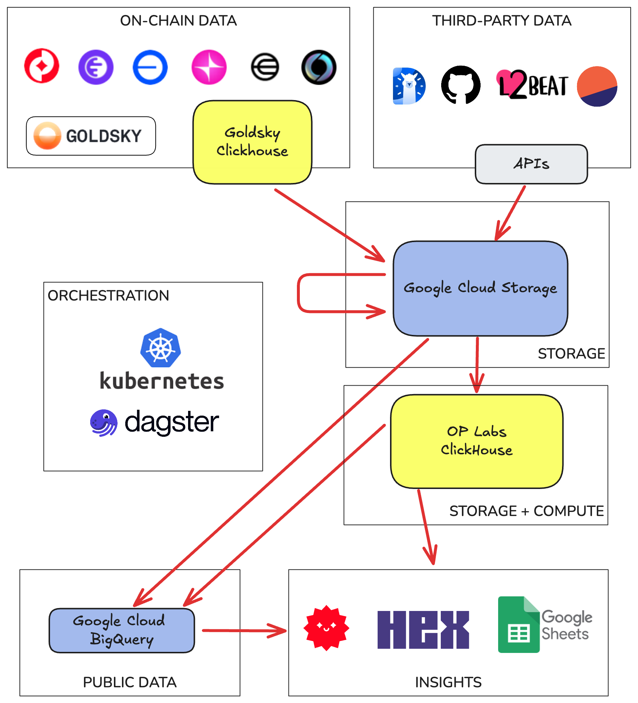
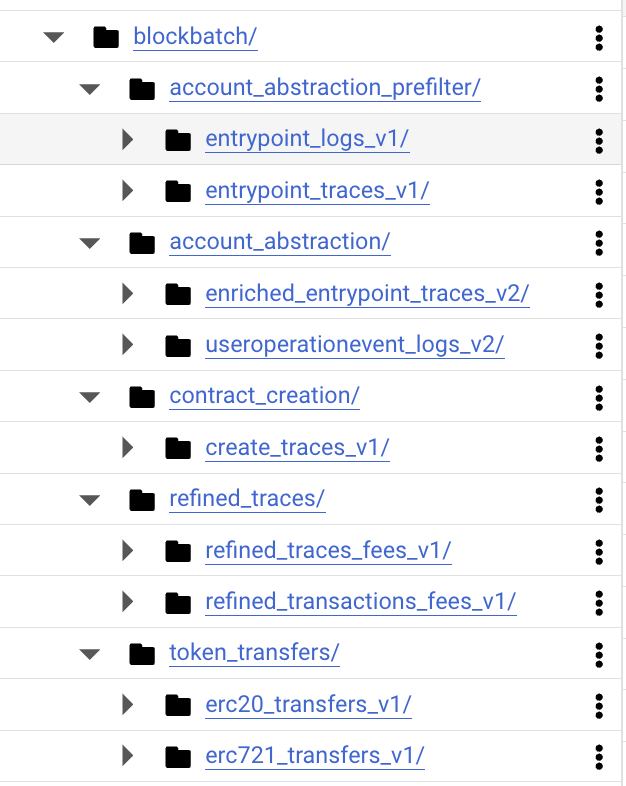

# Architecture

The diagram below shows the high level architecture of the OP Labs Data Platform.


<div style="text-align: center;">
    
</div>

## Ingestion

We ingest raw-onchain data from Goldsky, using a Goldsky-owned ClickHouse instance as the data
interface. 

We also ingest data from numerous third-party sources. Primarily from API endpoints, but also by
other means (public gcs buckets, reading onchain contracts, etc). 
 

## Storage

Our primary storage layer is Google Cloud Storage (GCS). All of the data we ingest is first stored
in GCS before any further processing.

We use a single GCS bucket for all data, with the following naming convention:
```
gs://BUCKET/ROOT_PATH/partitionA=0/partitionB=1/file.parquet
```

The `ROOT_PATH` of a dataset is almost like a table name. It can be nested, so we can group related
datasets together in a hierarchy. 

The most common partition used is `dt` (for date). We use it in almost all our datasets as we
generally stick to daily data processing. For multichain datasets we also use the `chain` partition.

The file format used is always Parquet.

Below we show some example root paths in GCS. These paths are for a family of tables called 
`blockbatch` (for the approach used to process them). As you can see we have multiple levels of
neseting:

<div style="text-align: left;">
    
</div>


## ClickHouse Data Warehouse 

We use ClickHouse as our data warehouse. From ClickHouse we can use the S3 Table Engine to read
data directly from GCS. We have a number of convenience functions that let us read by specifying
the root path of the data in GCS and a partition value. 


## Processing and Orchestration

We use dagster running on kubernetes to orchestrate ingestion and processing of data. This includes:

* Ingestion, which reads from our input data sources and writes to GCS. 
* Processing, which reads from GCS and writes back to GCS. 
* Transformations, which runs on the ClickHouse Data Warehouse. 
* Exports, which read  from GCS or ClickHouse and write to BigQuery. We use this for public tables
  and also to expose data to insight toosl that cannot read from ClickHouse directly.


## Insights

We use a number of tools to help us create dashboards and reports. Our main tool is Hex but we also
use Streamlit and Google Sheets.

